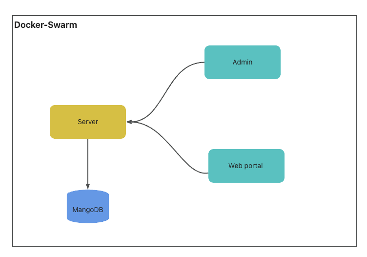

# arena-of-valor-moba-vue
## Demo
#### admin
* system management page

#### web
* web page


## Simple Structure


## Technology Stack
- Server
  - nodeJs
  - MangoDB
- Admin side
  - vue
  - ant-design
- Web-portal
  - vue
  - original css
- Deploy
 - docker swarm

## Guide
* **Note**: currently, it does not provide the creating user interface. So need manually to  add first admin user.
* Version
    ```js
    vue2.x
    node: 12.22.7
    ```
* Deploy mongoDB in docker 
    ```sh
    # default account
    username: root
    pwd: Aa123456
    ```
* Run server
    ```sh
    npm install
    npm run serve
    ```
* Run admin side
    ```sh
    npm install
    npm run serve

    # default account
    username: admin
    pwd: 123456
    ```
* Add information in admin management system
* Run web portal
    ```sh
    npm install
    npm run serve
    ```
